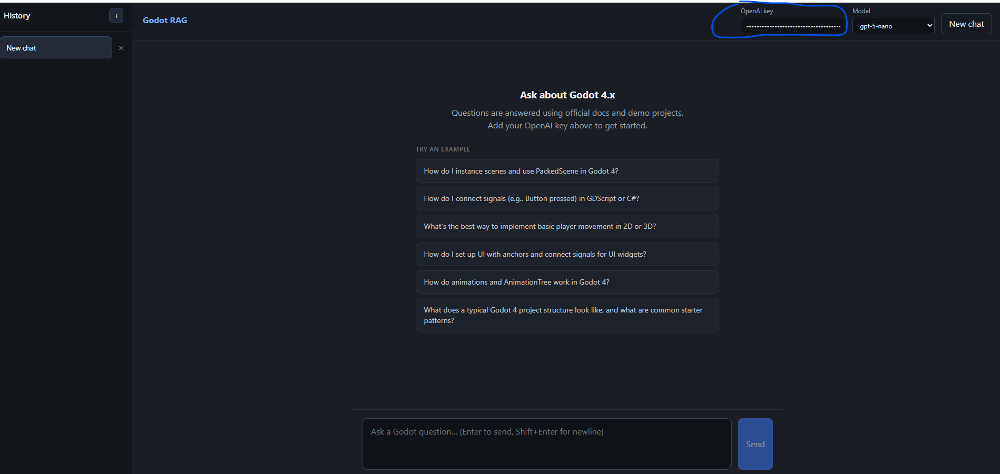

# API keys and environment variables

The Godot RAG agent uses **OpenAI** for answering questions. Vector search runs locally and does not need a cloud API key.

## Web UI (recommended)



1. Run `godot-web` and open [http://127.0.0.1:8000](http://127.0.0.1:8000)
2. Enter your **OpenAI API key** and **model** in the top bar
3. The key is stored in **browser `localStorage` only** — not on disk by the server

No `.env` file is required for the web UI.

## CLI and Python API

For `godot-ask` or `from godot_rag import ask`, use a `.env` file:

```powershell
copy .env.example .env
```

```
OPENAI_API_KEY=sk-your-key-here
OPENAI_MODEL=gpt-5-nano
```

**Never commit `.env`** — it is in `.gitignore`.

## Variables

| Variable | Required | Description |
|----------|----------|-------------|
| `OPENAI_API_KEY` | Yes (for agent answers) | [OpenAI API key](https://platform.openai.com/api-keys) |
| `OPENAI_MODEL` | No | Default: `gpt-5-nano` |

## What needs a key?

| Feature | OpenAI key needed? |
|---------|-------------------|
| Web UI (`godot-web`) | **Yes** — top bar |
| `godot-ask` / `ask()` | **Yes** — `.env` or env var |
| `godot-ask --search-only` / `search()` | **No** |

## Getting an OpenAI key

1. Sign in at [platform.openai.com](https://platform.openai.com)
2. Create a key under **API keys**
3. Ensure billing/credits are enabled for your chosen model

## Security

- **Local use only** — do not expose `godot-web` publicly without auth
- Do not commit keys or share `.env` in screenshots
- Rotate exposed keys at [platform.openai.com/api-keys](https://platform.openai.com/api-keys)

## Shell environment (alternative to `.env`)

```powershell
$env:OPENAI_API_KEY = "sk-your-key-here"
godot-ask "How does move_and_slide work?"
```

## Troubleshooting

| Error | Fix |
|-------|-----|
| API key popup in web UI | Add key in top bar |
| `OPENAI_API_KEY is not set` (CLI) | Create `.env` or export env var |
| Model not found / 404 | Pick a model your account supports |
